+++
date = '2026-09-30T02:23:02+08:00'
draft = false
title = 'How I Develop a C Application That Interact With Flathub Spotify Without Any Third Party Dependency'
author= "rustfeo891"
+++

## Introduction

In this blog I will talk aboout how I develop a c program that can interact with
flathub spotify with only libc and syscall without any third party dependency

## How it work

To understand how this work there are few thing that you need to understand
which is

1. dbus
2. syscall
3. socket

To begin with let explain 1. dbus first, a dbus is a ipc communication for different process,
in total it have two diffferent bus a system bus and a session bus,for the purpose of
interacting with flathub spotify we only care about the session bus,so what is a
session bus a session bus is used for the communication between a user process
to the application process.So let take a look at  how this thing really work by using a
tool call qdbus ,qdbus is a tool that can show and interact the dbus on your own system
,we can use qdbus by simply typing qdbus on the command line and it show the
dbus interface like this

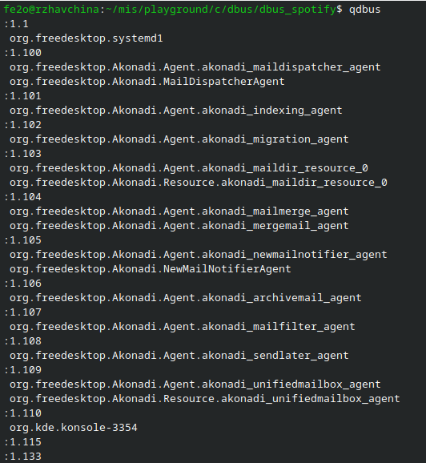

let look at the first line of the qbus output org.freedesktop.systemd1
as I mention before this is a dbus interface,and for every dbus
interface it will have it own method and property we can
take a deeper look to  org.freedesktop.systemd1 method
and property by typing qdbus  org.freedesktop.systemd1 
on the command line

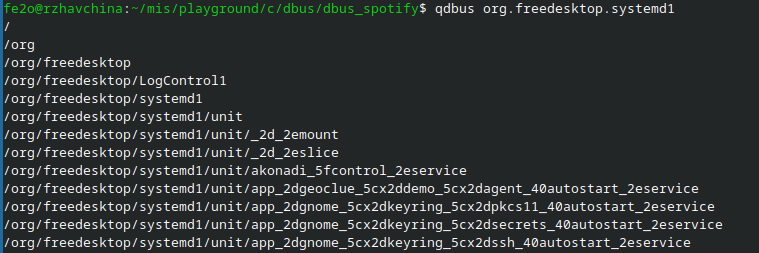

we cane see a bunch of /org/xxx these are called object path,because
when dbus sending signal between two process it doesn't just send the signal
to the whole application it just send the signal to one specific object
so we need to know the object path to send the signal to the object we
want so let try to introspect the object path /org/freedesktop which is second line of 
the output let type qdbus org.freedesktop.systemd1 /org/freedesktop on the command
line 
 
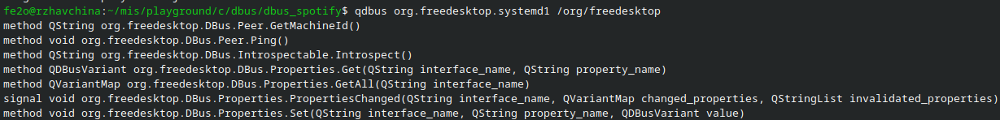
from the above output we can see different method that we can call
let try to call the org.freedesktop.DBus.Introspectable.Introspect() method 
which we can see will return a QString

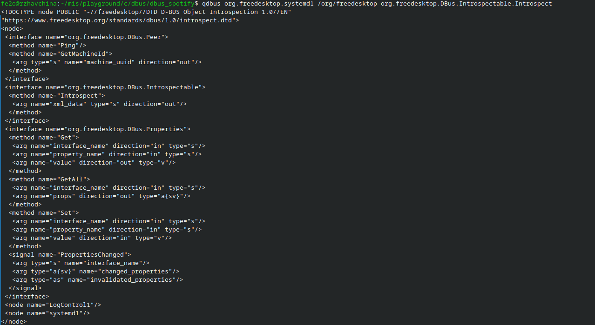

so we can see when we call the intospect method we get a bunch of string
so baiscally that all you need to know for dbus which is that
a dbus has a interface,method and object path and we can introospect
it by using qdbus I will not dig deeper into dbus as these
info are altready enough for you to understand how my
c program work.If you want to learn how dbus really
work you can take a look at the dbus doc 
https://dbus.freedesktop.org/doc/dbus-specification.html it
have a really good explanation of what dbus actually is

With this new found knowledge let take a look
at the spotify dbus

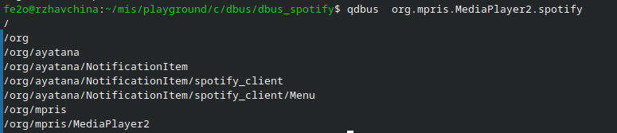

In this project we don't menu and notification we only
care about the song playing feature so let introspect
the object path /org/mpris/MediaPlayer2
by typing qdbus  org.mpris.MediaPlayer2.spotify /org/mpris/MediaPlayer2
and we get this:

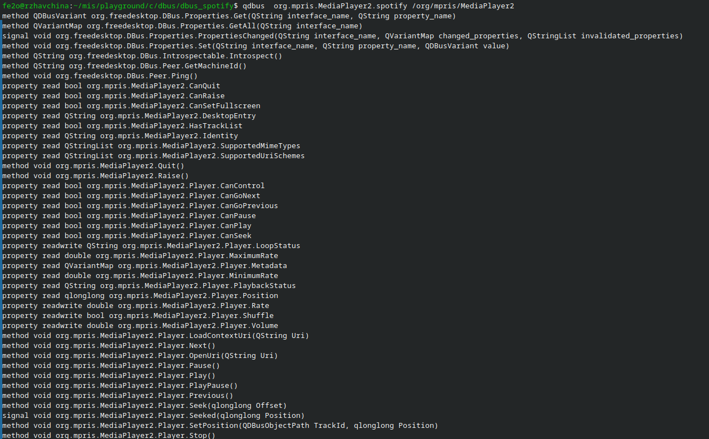

In these list of method we only care about 
1. method void org.mpris.MediaPlayer2.Player.Next()
2. method void org.mpris.MediaPlayer2.Player.Pause()
3. method void org.mpris.MediaPlayer2.Player.Play()
4. method void org.mpris.MediaPlayer2.Player.Previous()
5. method void org.mpris.MediaPlayer2.Player.Stop()

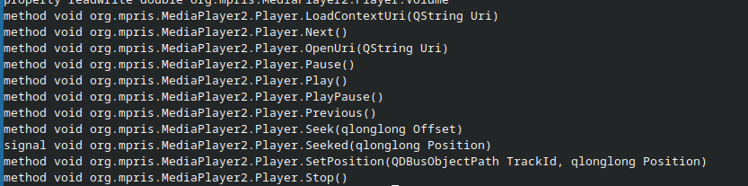

The idea is that if we can invoke these dbus method in c 
then we can controll spotify,normally people will use
a library to do that but actually we don't even need
a library to achieve that.And these is why we need
syscall to do that.

Let inrtoduce what is a syscall.
A system call is a mechanism that allows a user program to request a service 
from the operating system kernel. Programs use system calls when they 
need operations that require OS control or privileges, 
such as reading a file, creating a process, 
allocating memory, or communicating over a network. 
Basically syscall is just that a program makes a request, 
the CPU switches to kernel mode, and 
the operating system performs the operation and 
returns a result for the program.

So how can we know what syscall do a program perform
well we can use strace to do that so let say we
have a c program like this:

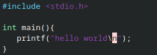

and we compile it with gcc

and we can know what syscall do hello program call by 
typing strace ./hello on the command line we can see

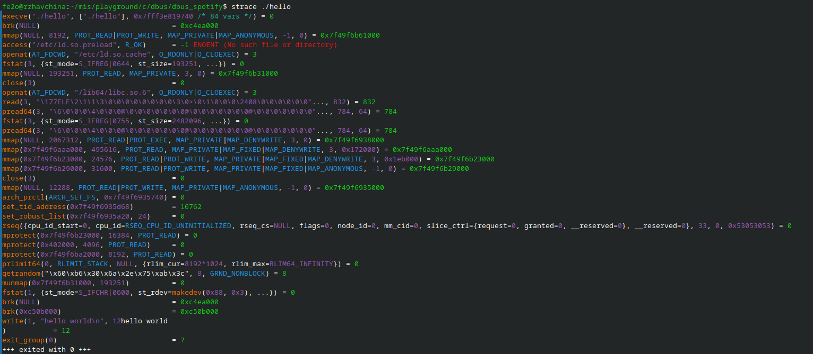

the only thing we care about is the write syscall

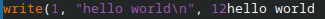

we can see that the hello program actually
use write syscall to print "hello world" on
screen.

One thing to notice is that we don't
need to remember all the syscall to
understand the strace becaus in linux
we have something call the manpage
if you are in linux you can use
man 2 write to get more info about
the write syscall

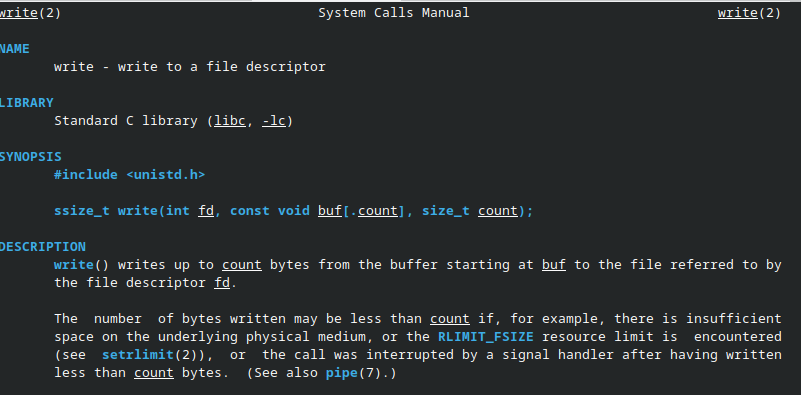 

By looking the man page we know that
write(1, "hello world\n", 12)
mean that the write syscall
will write to standard output(which is file desc 1)
and it will write "hello world" to the standard output
and the ouput length is 12.

So if you want to look up for any syscall that
you have no knowlegde about you can type
man 2 "syscall" or just look it up at google.

Well so how syscall and strace related to my c program?
Simple we know that qdbus can invoke the spotify dbus
method if we know what syscall do qdbus use to do that
and we use those syscall in c then we can controll
spotify so we just need to strace qdbus invoking
the spotify method to know what syscall we need 

we can do this by typing:
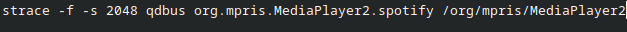
the -f mean trace the child process and -s specific the
length of strace output because if the output is really long
it will become .... and we cann't see the actual thing

So what syscall do we need to look for?

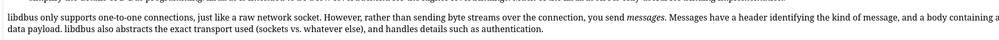

Well there is a clue at https://dbus.freedesktop.org/doc/dbus-tutorial.html
we see that it mention:

"libdbus only supports one-to-one connections, just 
like a raw network socket. However, rather than sending byte streams over 
the connection, you send messages. Messages have a header identifying the 
kind of message, and a body containing a data payload. libdbus 
also abstracts the exact transport used (sockets vs. whatever else), 
and handles details such as authentication. "

Which imply that dbus use socket to do thye ipc lett loomk for the socket syscall
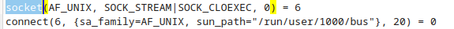

now we find:

socket(AF_UNIX, SOCK_STREAM|SOCK_CLOEXEC, 0) = 6

connect(6, {sa_family=AF_UNIX, sun_path="/run/user/1000/bus"}, 20) = 0

from man 2 connect we know that:

int connect(int sockfd, const struct sockaddr *addr,socklen_t addrlen);

so the first arg of connect is the file desc

and the second arg is the socket address

and the third arg is the address length

let google what do the socket address "/run/user/1000/bus" mean

I find a debian forum:
[Solved] so what is run-user-1000 ??
https://forums.debian.net/viewtopic.php?t=157687

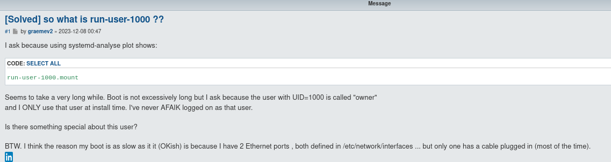
 
It seem that this is a temporary path made by
the system for dbus and the 1000 is the uid for
owner great!

let write the same thing in c:

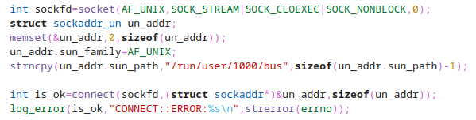

let look at the next strace:

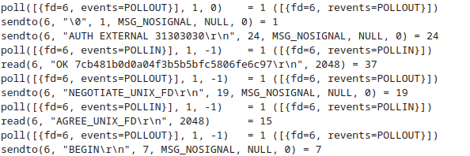

we see

poll([{fd=6, events=POLLOUT}], 1, 0)

which mean that we are going to tell
the kernel we to watch the socket
and notify the program that
when writing data it will not block
then we do the write:

sendto(6, "\0", 1, MSG_NOSIGNAL, NULL, 0) = 1

sendto(6, "AUTH EXTERNAL 31303030\r\n", 24, MSG_NOSIGNAL, NULL, 0) = 24

under the example section of 
https://dbus.freedesktop.org/doc/dbus-specification.html:

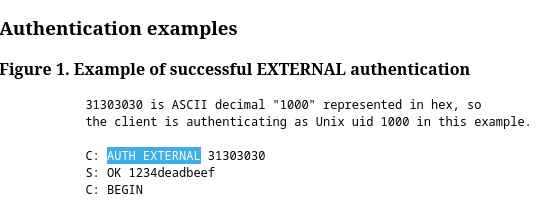

we can see that this mean
the client is authenticing as Unix uid
1000 (the 31303030 mean 1000)

and I will skip the syscall after 

sendto(6, "AUTH EXTERNAL 31303030\r\n", 24, MSG_NOSIGNAL, NULL, 0) 

you con consult the doc yourself to understand

what do those send to mean 

again let translate those syscall in c again

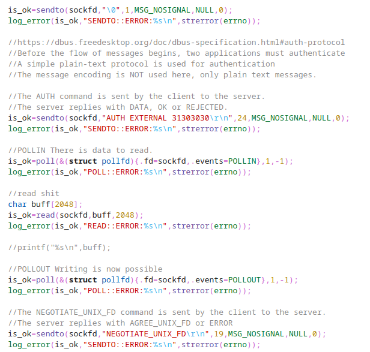

So that is what we need to do
We look at the strace log and translate them in c
keep repeating this process then we will
get a program that can controll spotifiy without
any third party dependency I will not
do any further explanation with this new found knowledge you can
try out the rest by yourself
